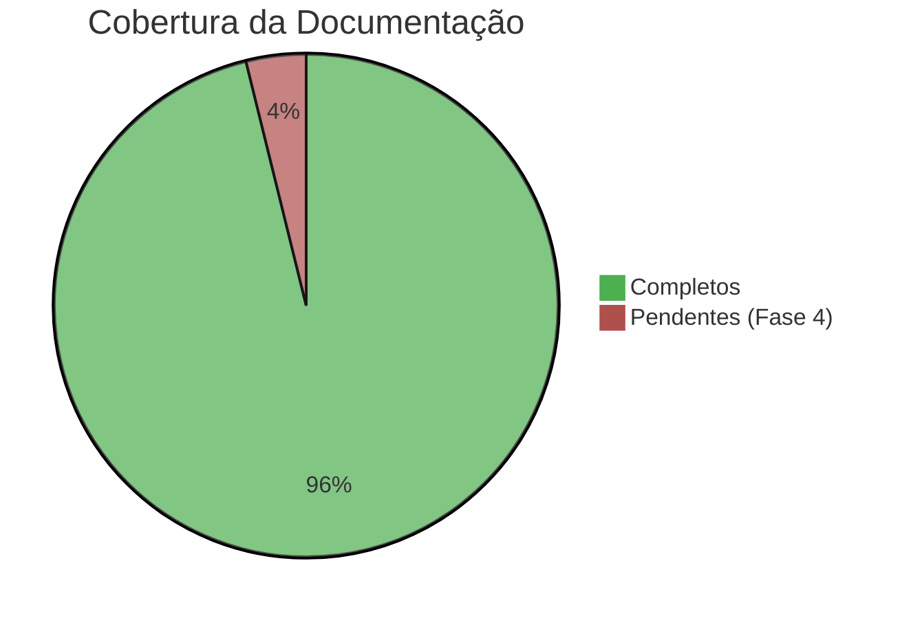
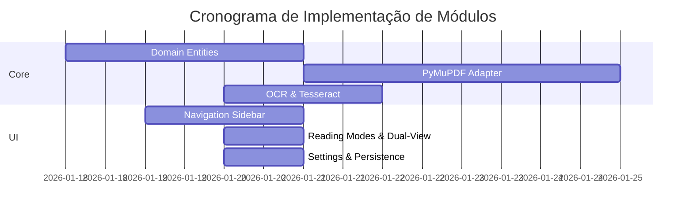

# 🎛️ Dashboard do Projeto

> **Central de Comando**: Visão executiva do estado atual do **fotonPDF**

## 📊 Status Geral

## 🚦 Semáforo de Progresso

| Fase | Status | Progresso | Deadline |
| --- | --- | --- | --- |
| **Fase 1: Fundação** | 🟢 Completo | ████████████ 100% | Finalizada ✅ |
| **Fase 2: Interface & Func.** | 🟢 Completo | ████████████ 100% | 20/01/2026 ✅ |
| **Fase 3: Ecossistema** | 🟢 Completo | ████████████ 100% | 23/01/2026 ✅ |
| **Fase 3.5: Navegação Premium** | 🟢 Completo | ████████████ 100% | 27/01/2026 ✅ |
| **Fase 4: Plugins** | 🏗️ Em Progresso | [██░░░░░░░░░░░░░░░░░░] 10% | Prev. Fev/2026 |
| **Q&A: Cobertura 90%** | 🟢 Completo | ████████████ 100% | 24/01/2026 ✅ |

### Sprint 22 (Em Progresso) 🏗️

- [x] Menu Lúdico v2 🎨
- [x] Extração Pro (Assíncrona) 📄
- [x] Reordenação Espacial na Mesa de Luz 📐
- [x] Viewport Dinâmica (Fix Rotação) 🔄
- [x] Resolução de Identidade Virtual (Fix de Reordenação) 🔗
- [ ] Zoom por Área (RubberBand) 🔍
- [ ] Renderização Assíncrona da Primeira Página ⚡
- [ ] Testes E2E para Navegação 🧪
- [ ] Merge para `develop` 🚀

### Sprint 21 (Concluído) ✅

- [x] ModernNavBar com Transparência Dinâmica 🎨
- [x] NavHub (Volante de Controle) 🎮
- [x] Atalhos Estilo Okular ⌨️
- [x] Zoom Focado no Mouse 🎯
- [x] Mesa de Luz Hi-Res 📐
- [x] Suporte A0/A1 (Tiling) 🏗️

### Sprint 20 (Concluído) ✅

- [x] Stabilized Test Infrastructure 🧪
- [x] Windows Registry Mock Adapter 🛠️
- [x] UI Widget Unit Tests (TopBar, Canvas) 🎨
- [x] 90%+ Coverage Achievement 🚀

### Sprint 10 (Concluído) ✅

- [x] Settings Service (Persistência) 💾
- [x] Modos de Leitura (Sépia/Noite/Invertido) 👁️
- [x] Dual-View Layout 📖
- [x] Anotações Básicas (Highlight) ✍️
- [x] Refinamento Estético & Glow Effects ✨

### Sprint 7 (Concluído) ✅

- [x] Detecção inteligente de PDFs sem camada de texto 🔍
- [x] Aplicação de OCR Tesseract em documento completo 📄
- [x] Extração interativa de área via mouse (On-demand) ✂️
- [x] Banner proativo de sugestão de OCR 🔔

## 🧩 Módulos Implementados

---

**Última atualização:** 2026-01-28  
**Próxima revisão:** Início da Fase 4

[[MAP|← Voltar ao Mapa]] | [[REPORT|📊 Ver Relatório Completo]]
