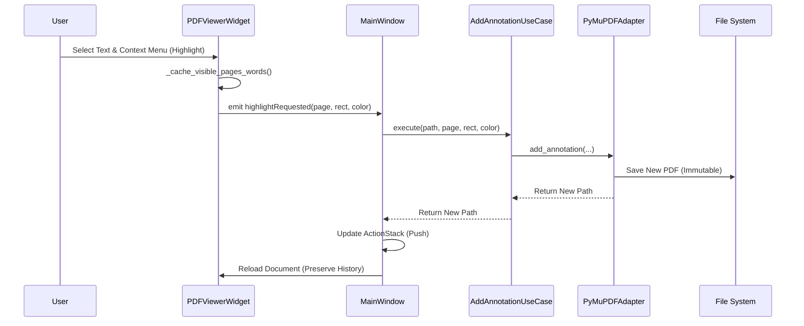
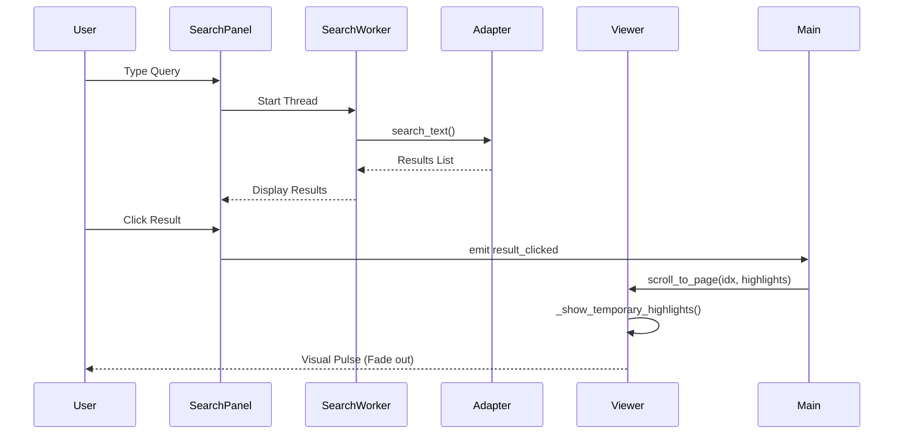

# System Pipelines

## 1. Core UX Pipeline (Highlight)

```mermaid
sequenceDiagram
    participant User
    participant Viewer as PDFViewerWidget
    participant Main as MainWindow
    participant UC as AddAnnotationUseCase
    participant Adapter as PyMuPDFAdapter
    participant File System

    User->>Viewer: Select Text & Context Menu (Highlight)
    Viewer->>Viewer: _cache_visible_pages_words()
    Viewer->>Main: emit highlightRequested(page, rect, color)
    Main->>UC: execute(path, page, rect, color)
    UC->>Adapter: add_annotation(...)
    Adapter->>File System: Save New PDF (Immutable)
    Adapter-->>UC: Return New Path
    UC-->>Main: Return New Path
    Main->>Main: Update ActionStack (Push)
    Main->>Viewer: Reload Document (Preserve History)
```

## 2. Search & Navigation Pipeline

```mermaid
sequenceDiagram
    participant User
    participant Search as SearchPanel
    participant Worker as SearchWorker
    participant Adapter
    participant Viewer

    User->>Search: Type Query
    Search->>Worker: Start Thread
    Worker->>Adapter: search_text()
    Adapter-->>Worker: Results List
    Worker-->>Search: Display Results
    User->>Search: Click Result
    Search->>Main: emit result_clicked
    Main->>Viewer: scroll_to_page(idx, highlights)
    Viewer->>Viewer: _show_temporary_highlights()
    Viewer-->>User: Visual Pulse (Fade out)
```
