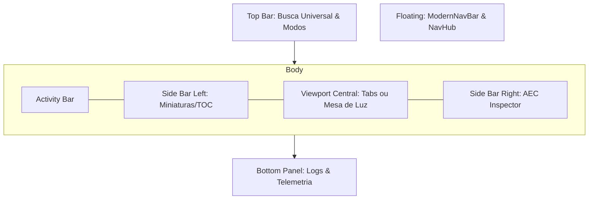

# 🏗️ Arquitetura do Sistema

O **fotonPDF** utiliza uma abordagem híbrida que une a **Arquitetura Hexagonal (Ports & Adapters)** com o conceito de **Monólito Modular**.

## 🧬 O Conceito Híbrido

1. **Hexagonal:** Garante que a lógica de "como girar um PDF" seja independente de "qual biblioteca usamos" ou "se foi clicado no Windows ou Linux". O núcleo (`domain` e `application`) é isolado das portas de entrada e saída.
2. **Monólito Modular (GUI):** A interface é composta por widgets independentes que não se conhecem diretamente. Eles se comunicam apenas através da `MainWindow` usando o sistema de sinais do Qt (PyQt6), o que permite trocar ou mover componentes sem quebrar o sistema.

## 📐 Camadas

### 1. Domínio (`src/domain`)

- Onde residem as regras de negócio puras.
- **Entidades:** `PDFDocument`, `Page`, `Coordinates`.
- **Portas (Interfaces):** `PDFProcessorPort`, `FileSystemPort`.

### 2. Aplicação (`src/application`)

- Orquestra os casos de uso.
- Exemplos: `RotatePDFUseCase`, `MergeFilesUseCase`.
- Não conhece detalhes de implementação (não importa `fitz` ou `winreg`).

### 3. Infraestrutura (`src/infrastructure`)

- Implementações concretas e pesadas.
- **Adapters:** `PyMuPDFAdapter`, `WindowsRegistryAdapter`.
- Aqui lidamos com o "mundo real" (disco, rede, SO).

### 4. Interfaces (`src/interfaces`)

- Pontos de entrada para o usuário.
- **Monolito de Orquestração:** a `MainWindow` atua como o ponto de entrada principal, coordenando a comunicação entre os módulos via sinais.
- **Componentes Modulares (`src/interfaces/gui/widgets`):**
  - `TabContainer`: Gerencia o estado de múltiplos documentos abertos.
  - `SideBar`: Painéis laterais reutilizáveis (Esquerda/Direita).
  - `BottomPanel`: Gerencia notificações e logs de forma independente.
  - `EditorGroup`: Encapsula a lógica de visualização e "Async Split".

## 🎨 Anatomia da Interface (Skeleton)

O fotonPDF segue uma estrutura canônica de "IDE de Engenharia", organizando elementos em camadas lógicas para reduzir a carga cognitiva.

### Elementos Estruturais e seu "Abrigo"

1. **Top Bar (`TopBarWidget`)**: Abriga a Busca Universal (Command Palette), alternadores de modo (Scroll/Mesa) e controles globais de layout.
2. **Activity Bar**: Localizada na extrema esquerda, abriga os ícones de contexto que definem qual painel será exibido na SideBar Left.
3. **Side Bar Left**: Abriga o conteúdo auxiliar (Miniaturas, Sumário, Ferramentas de Busca).
4. **Central Viewport**: O coração da renderização. Suporta múltiplos documentos via abas ou a **Mesa de Luz Profissional** (Light Table).
5. **Side Bar Right (AEC Inspector)**: Abriga dados técnicos profundos, propriedades de camadas e inspeção de metadados BIM/CAD.
6. **Bottom Panel**: Abriga logs de sistema em tempo real e telemetria de performance (TTU, Render Time).
7. **Elementos Flutuantes**: Orbitam a área central. A **ModernNavBar** controla navegação e zoom, enquanto o **NavHub** (volante) gerencia a troca de ferramentas de interação.
  
### 5. Resiliência e Tolerância a Falhas (`src/interfaces/gui/utils`)

- **UI Error Boundaries**: O projeto utiliza o decorador `@safe_ui_callback` para envolver funções críticas do Qt. Isso isola falhas, evitando que uma exceção em um widget (como erro de renderização) derrube toda a aplicação.
- **Global Exception Hook**: Um hook de exceção global (`sys.excepthook`) captura erros não tratados e os direciona para o `BottomPanel`, mantendo a UI responsiva.
- **Resilient Widgets**: Widgets que herdam de `ResilientWidget` possuem estados de placeholder automáticos para lidar com dados ausentes ou carregamentos falhos.

## 🔄 Fluxo de Uma Operação

1. Usuário clica em "Girar 90º" no Menu de Contexto.
2. O SO executa o comando `foton-cli --rotate 90 --file path/to.pdf`.
3. A `CLI Interface` recebe o comando e chama o `RotatePDFUseCase`.
4. O `UseCase` solicita ao `PyMuPDFAdapter` (via porta) que execute a rotação.
5. O arquivo é salvo e uma notificação de sistema é disparada.

## 📦 Infraestrutura de Distribuição

A arquitetura do fotonPDF se estende além do código rodando na máquina:

- **Build Pipeline (GitHub Actions)**: Garante builds reprodutíveis e validação de paridade de versão.
- **Integridade (Code Signing)**: Camada de segurança que assina os binários gerados.
- **Encapsulamento (Inno Setup)**: Abstrai a complexidade da instalação do Windows para uma experiência de clique único.

## 🔗 Veja Também

- [[DEVELOPMENT|Workflow e Padrões]]
- [[MAP|Voltar ao Mapa]]

---
[[MAP|← Voltar ao Mapa]]
