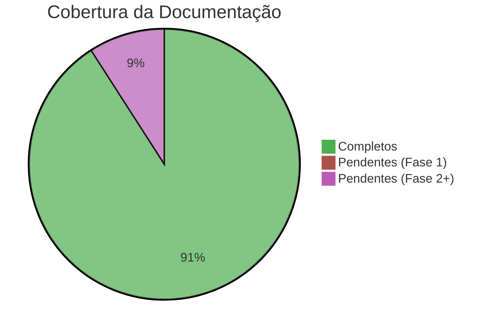
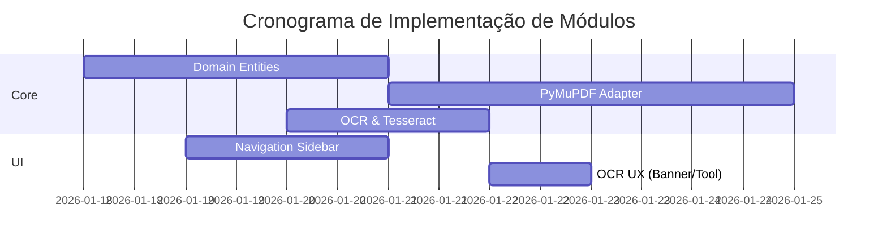
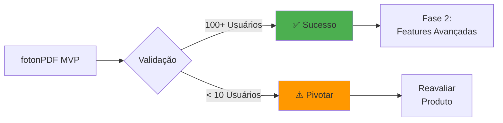

# 🎛️ Dashboard do Projeto

> **Central de Comando**: Visão executiva do estado atual do **fotonPDF**

## 📊 Status Geral

## 🚦 Semáforo de Progresso

| Fase | Status | Progresso | Deadline |
29: | **Sprint 0 - Kickoff** | 🟢 Completo | ████████████ 100% | 17/01/2026 ✅ |
20: | **Sprint 1 - Core MVP** | 🟢 Completo | ████████████ 100% | 20/01/2026 ✅ |
21: | **Sprint 2 - Integração** | 🟢 Completo | ████████████ 100% | 14/02/2026 ✅ |
22: | **Sprint 3 - UI** | 🟢 Completo | ████████████ 100% | 28/02/2026 ✅ |
23: | **Sprint 4 - Polimento** | 🟢 Completo | ████████████ 100% | 15/03/2026 ✅ |
24: | **Sprint 5 - Distribuição 2.0** | 🟢 Completo | ████████████ 100% | 19/01/2026 ✅ |
25: | **Geral - Automação CI/CD** | 🟢 Completo | ████████████ 100% | 19/01/2026 ✅ |
26: | **Geral - Identidade Visual** | 🟢 Completo | ████████████ 100% | 19/01/2026 ✅ |
27: | **Sprint 6 - Navegação** | 🟢 Completo | ████████████ 100% | 20/01/2026 ✅ |
28: | **Sprint 7 - OCR** | 🟢 Completo | ████████████ 100% | 21/01/2026 ✅ |

### Sprint 7 (Concluído) ✅

- [x] Detecção inteligente de PDFs sem camada de texto 🔍
- [x] Aplicação de OCR Tesseract em documento completo 📄
- [x] Extração interativa de área via mouse (On-demand) ✂️
- [x] Banner proativo de sugestão de OCR 🔔

### Sprint 6 (Concluído) ✅

- [x] Motor de busca indexado (PyMuPDF) 🔍
- [x] Painel Lateral de Resultados com Snippets 📋
- [x] Sumário (Bookmarks) Hierárquico 📍
- [x] Histórico de Navegação Avançar/Voltar ⬅️➡️
- [x] Atalho Global `Ctrl+F` ⚡

## 🧩 Módulos Implementados

## 🔗 Links Rápidos

### 📘 Documentação Essencial

- [[MAP|🗺️ Mapa de Navegação]]
- [[QUICKSTART|⚡ Início Rápido (QUICKSTART)]]
- [[ARCHITECTURE|🏗️ Arquitetura]]
- [[ROADMAP|🚀 Roadmap Completo]]

## 🎯 KPIs do Projeto

---

**Última atualização:** 2026-01-21  
**Próxima revisão:** Final da Sprint 8 (UI Evolution)

[[MAP|← Voltar ao Mapa]] | [[REPORT|📊 Ver Relatório Completo]]
