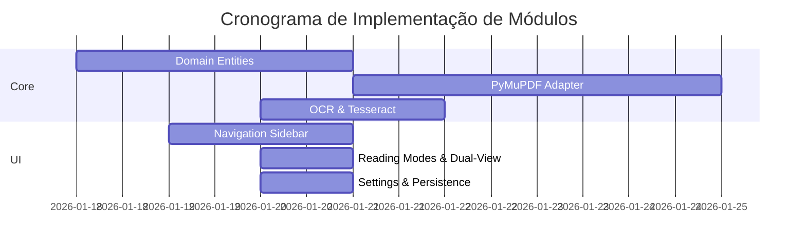

# 🎛️ Dashboard do Projeto

> **Central de Comando**: Visão executiva do estado atual do **fotonPDF**

## 📊 Status Geral

## 🚦 Semáforo de Progresso

| Fase | Status | Progresso | Deadline |
| --- | --- | --- | --- |
| **Fase 1: Fundação** | 🟢 Completo | ████████████ 100% | Finalizada ✅ |
| **Fase 2: Interface & Func.** | 🟢 Completo | ████████████ 100% | 20/01/2026 ✅ |
| **Fase 3: Ecossistema** | 🏗️ Em Progresso | [--------------------] 0% | Prev. Fev/2026 |

### Sprint 8 (Concluído) ✅

- [x] Settings Service (Persistência) 💾
- [x] Modos de Leitura (Sépia/Noite/Invertido) 👁️
- [x] Dual-View Layout 📖
- [x] Anotações Básicas (Highlight) ✍️
- [x] Refinamento Estético & Glow Effects ✨

### Sprint 7 (Concluído) ✅

- [x] Detecção inteligente de PDFs sem camada de texto 🔍
- [x] Aplicação de OCR Tesseract em documento completo 📄
- [x] Extração interativa de área via mouse (On-demand) ✂️
- [x] Banner proativo de sugestão de OCR 🔔

## 🧩 Módulos Implementados

---

**Última atualização:** 2026-01-21  
**Próxima revisão:** Final da Sprint 9 (Ecossistema)

[[MAP|← Voltar ao Mapa]] | [[REPORT|📊 Ver Relatório Completo]]
