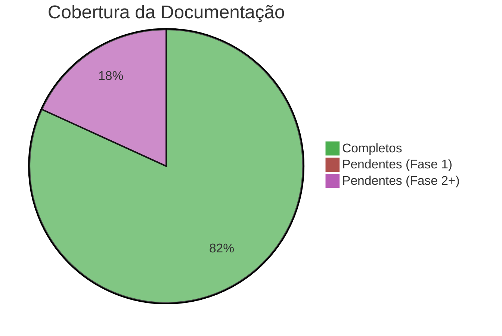
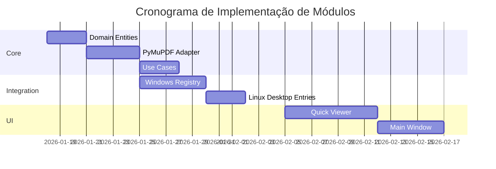
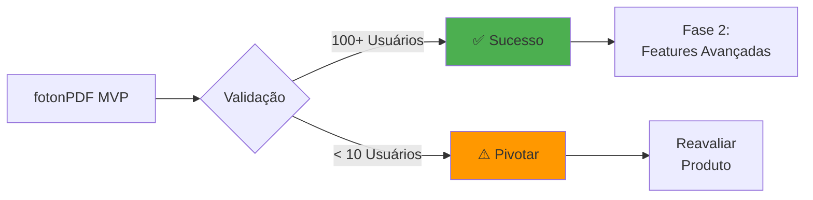

# 🎛️ Dashboard do Projeto

> **Central de Comando**: Visão executiva do estado atual do **fotonPDF**

## 📊 Status Geral

## 🚦 Semáforo de Progresso

| Fase | Status | Progresso | Deadline |
| --- | --- | --- | --- |
| **Sprint 0 - Kickoff** | 🟢 Completo | ████████████ 100% | 17/01/2026 ✅ |
| **Sprint 1 - Core MVP** | 🟢 Completo | ████████████ 100% | 20/01/2026 ✅ |
| **Sprint 2 - Integração** | 🟢 Completo | ████████████ 100% | 14/02/2026 ✅ |
| **Sprint 3 - UI** | 🟢 Completo | ████████████ 100% | 28/02/2026 ✅ |
| **Sprint 4 - Polimento** | 🟢 Completo | ████████████ 100% | 15/03/2026 ✅ |
| **Sprint 5 - Distribuição 2.0** | 🟢 Completo | ████████████ 100% | 19/01/2026 ✅ |
| **Geral - Automação CI/CD** | 🟢 Completo | ████████████ 100% | 19/01/2026 ✅ |
| **Geral - Identidade Visual** | 🟢 Completo | ████████████ 100% | 19/01/2026 ✅ |
| **Sprint 6 - Inteligência de Busca** | 🟢 Completo | ████████████ 100% | 20/01/2026 ✅ |

### Sprint 6 (Concluído) ✅

- [x] Motor de busca indexado (PyMuPDF) 🔍
- [x] Painel Lateral de Resultados com Snippets 📋
- [x] Sumário (Bookmarks) Hierárquico 📍
- [x] Histórico de Navegação Avançar/Voltar ⬅️➡️
- [x] Atalho Global `Ctrl+F` ⚡

### Sprint 3 (Concluído) ✅

- [x] Interface Gráfica (GUI) em PyQt6 ✅
- [x] Visualizador com Motor de Renderização Centralizado (Thread-Safe) 🚀
- [x] Navegação por Miniaturas (Thumbnails) com fundo opaco
- [x] Toolbar Reorganizada (Navegação, Edição, Conversão) 🛠️
- [x] Ferramentas de Conversão (Imagem, SVG, Markdown) 🚀
- [x] Fit-to-Width inteligente baseado na página atual

### Sprint 2 (Concluído) ✅

- [x] Expansão do Engine (Merge/Split)
- [x] Integração com Windows Registry (Menu de Contexto)
- [x] Sistema de Notificações Nativas (Plyer)
- [x] Atualização da CLI para múltiplas operações
- [x] Suíte de testes (7/7 passados)

### Sprint 1 (Concluído) ✅

## 🧩 Módulos Implementados

## 🔗 Links Rápidos

### 📘 Documentação Essencial

- [[MAP|🗺️ Mapa de Navegação]]
- [[QUICKSTART|⚡ Início Rápido (QUICKSTART)]]
- [[ARCHITECTURE|🏗️ Arquitetura]]
- [[ROADMAP|🚀 Roadmap Completo]]

### 🛠️ Para Desenvolvedores

- [[DEVELOPMENT|Padrões de Código]]
- [[guides/NEW_OPERATION|Como Adicionar Operação]]
- [[../CONTRIBUTING|Guia de Contribuição]]

### 💰 Para Stakeholders

- [[BUSINESS|Modelo de Sustentabilidade]]
- [[REPORT|Relatório de Documentação]]

## 📈 Métricas de Código (Previsto)

| Métrica | Meta Sprint 1 | Meta MVP |
| --- | --- | --- |
| Cobertura de Testes | 70% | 80% |
| Type Hints | 100% | 100% |
| Linhas de Código | ~1.500 | ~5.000 |
| Tempo de Build | < 10s | < 20s |

## 🎯 KPIs do Projeto

### Critérios de Sucesso (3 meses)

- ✅ **Funcional:** Todas operações MVP sem bugs críticos.
- 🎯 **Adoção:** 100+ downloads/instalações ativas.
- 🎯 **Engagement:** 30% de retenção semanal.
- 🎯 **Performance:** Operações < 2s para PDFs de 100 páginas.
- 🎯 **NPS:** > 40 (Net Promoter Score).

## 🐛 Issues Abertas (GitHub)

> **Tracking Central**: Seção para acompanhamento manual de débitos técnicos e melhorias.

- [ ] #001: Setup inicial do repositório
- [ ] #002: Implementar rotação de PDF
- [ ] #003: Integração com Windows Explorer

## 💡 Ideias Futuras (Backlog)

1. **Compressão Inteligente**: Ajuste automático baseado no conteúdo.
2. **Batch Processing**: Processar múltiplos arquivos em paralelo.
3. **Cloud Sync**: Sincronização com Dropbox/OneDrive.
4. **LLM Integration**: Resumos automáticos de PDFs longos.
5. **OCR Nativo**: Integração com Tesseract sem dependências externas.

## 📞 Contatos

- **Repositório:** (a definir)
- **Discussões:** (a definir)
- **Issues:** (a definir)
- **Email:** (a definir)

---

**Última atualização:** 2026-01-20  
**Próxima revisão:** Final da Sprint 7 (OCR & Camada de Texto)

[[MAP|← Voltar ao Mapa]] | [[REPORT|📊 Ver Relatório Completo]]
