# 🎛️ Dashboard do Projeto

> **Central de Comando**: Visão executiva do estado atual do **fotonPDF**

## 📊 Status Geral

```mermaid
%%{init: {'theme':'base', 'themeVariables': { 'primaryColor':'#4CAF50'}}}%%
pie title Cobertura da Documentação
    "Completos" : 13
    "Pendentes (Fase 1)" : 2
    "Pendentes (Fase 2+)" : 4
```

## 🚦 Semáforo de Progresso

| Fase | Status | Progresso | Deadline |
|------|--------|-----------|----------|
| **Sprint 0 - Kickoff** | 🟢 Completo | ████████████ 100% | 17/01/2026 ✅ |
| **Sprint 1 - Core MVP** | 🟢 Completo | ████████████ 100% | 20/01/2026 ✅ |
| **Sprint 2 - Integração** | 🟡 Iniciando | ░░░░░░░░░░░░ 0% | 14/02/2026 |
| **Sprint 3 - UI** | ⚪ Planejado | ░░░░░░░░░░░░ 0% | 28/02/2026 |

## 📋 Próximas Tarefas (Sprint 2)

### Prioridade Alta 🔴

- [ ] Implementar `RegisterAdapter` no Windows (Menu de Contexto)
- [ ] Criar Caso de Uso: `MergePDFUseCase`
- [ ] Criar Caso de Uso: `SplitPDFUseCase`
- [ ] Integrar Notificações Nativas do Sistema

### Prioridade Média 🟡

- [ ] Documentar módulo de Integração com SO
- [ ] Melhorar CLI para aceitar múltiplos arquivos
- [ ] Implementar logging estruturado para operações em lote

### Sprint 1 (Concluído) ✅

- [x] Setup da estrutura de diretórios `src/` (Hexagonal)
- [x] Implementação de entidades básicas e portas no `domain/`
- [x] Implementação do `PyMuPDFAdapter` em `infrastructure/`
- [x] Caso de uso: Rotação de PDF
- [x] Implementação da CLI básica para rotação
- [x] Suíte de testes unitários e integração (3/3 passados)

## 🧩 Módulos Implementados

```mermaid
gantt
    title Cronograma de Implementação de Módulos
    dateFormat  YYYY-MM-DD
    section Core
    Domain Entities       :a1, 2026-01-18, 3d
    PyMuPDF Adapter       :a2, after a1, 4d
    Use Cases             :a3, after a2, 3d
    section Integration
    Windows Registry      :b1, 2026-01-25, 5d
    Linux Desktop Entries :b2, after b1, 3d
    section UI
    Quick Viewer          :c1, 2026-02-05, 7d
    Main Window           :c2, after c1, 5d
```

## 🔗 Links Rápidos

### 📘 Documentação Essencial

- [[MAP|🗺️ Mapa de Navegação]]
- [[ARCHITECTURE|🏗️ Arquitetura]]
- [[ROADMAP|🚀 Roadmap Completo]]

### 🛠️ Para Desenvolvedores

- [[DEVELOPMENT|Padrões de Código]]
- [[guides/NEW_OPERATION|Como Adicionar Operação]]
- [[../CONTRIBUTING|Guia de Contribuição]]

### 💰 Para Stakeholders

- [[BUSINESS|Modelo de Sustentabilidade]]
- [[REPORT|Relatório de Documentação]]

## 📈 Métricas de Código (Previsto)

| Métrica | Meta Sprint 1 | Meta MVP |
|---------|---------------|----------|
| Cobertura de Testes | 70% | 80% |
| Type Hints | 100% | 100% |
| Linhas de Código | ~1.500 | ~5.000 |
| Tempo de Build | < 10s | < 20s |

## 🎯 KPIs do Projeto

### Critérios de Sucesso (3 meses)

- ✅ **Funcional:** Todas operações MVP sem bugs críticos.
- 🎯 **Adoção:** 100+ downloads/instalações ativas.
- 🎯 **Engagement:** 30% de retenção semanal.
- 🎯 **Performance:** Operações < 2s para PDFs de 100 páginas.
- 🎯 **NPS:** > 40 (Net Promoter Score).

## 🐛 Issues Abertas (GitHub)

*Seção para tracking - será atualizada manualmente*

- [ ] #001: Setup inicial do repositório
- [ ] #002: Implementar rotação de PDF
- [ ] #003: Integração com Windows Explorer

## 💡 Ideias Futuras (Backlog)

1. **Compressão Inteligente**: Ajuste automático baseado no conteúdo.
2. **Batch Processing**: Processar múltiplos arquivos em paralelo.
3. **Cloud Sync**: Sincronização com Dropbox/OneDrive.
4. **LLM Integration**: Resumos automáticos de PDFs longos.
5. **OCR Nativo**: Integração com Tesseract sem dependências externas.

## 📞 Contatos

- **Repositório:** (a definir)
- **Discussões:** (a definir)
- **Issues:** (a definir)
- **Email:** (a definir)

```mermaid
graph LR
    A[fotonPDF MVP] --> B{Validação}
    B -->|100+ Usuários| C[✅ Sucesso]
    B -->|< 10 Usuários| D[âš ï¸ Pivotar]
    
    C --> E[Fase 2:<br/>Features Avançadas]
    D --> F[Reavaliar<br/>Produto]
    
    style C fill:#4CAF50
    style D fill:#FF9800
```

---

**Última atualização:** 2026-01-17  
**Próxima revisão:** Fim da Sprint 1 (31/01/2026)

[[MAP|← Voltar ao Mapa]] | [[REPORT|📊 Ver Relatório Completo]]
