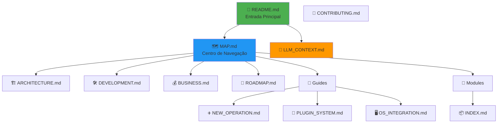
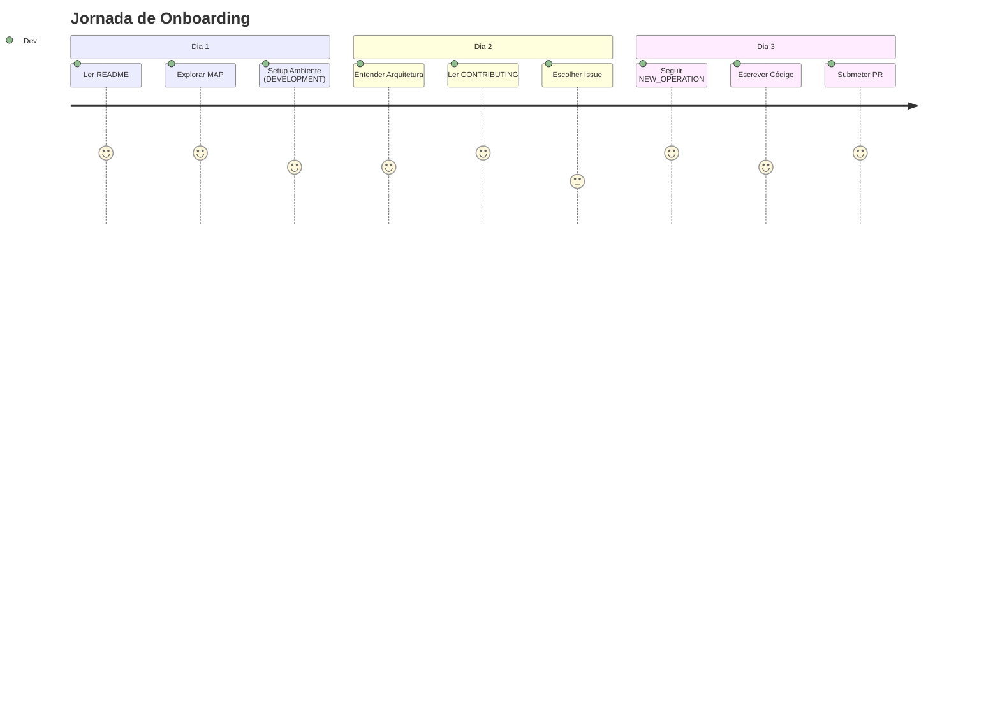
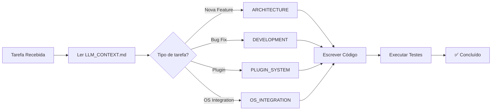
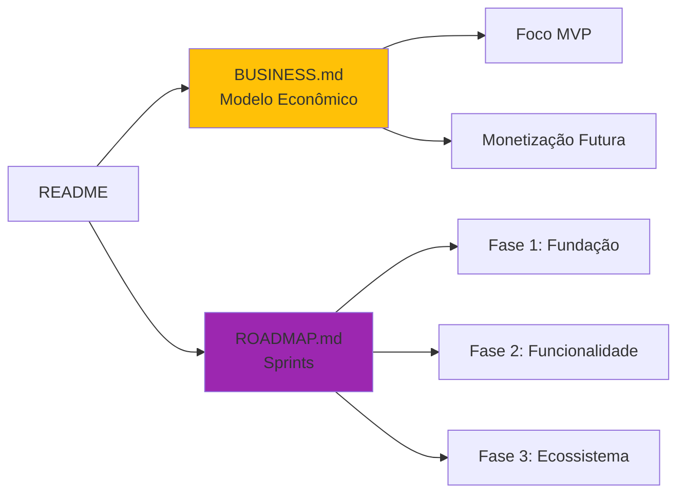
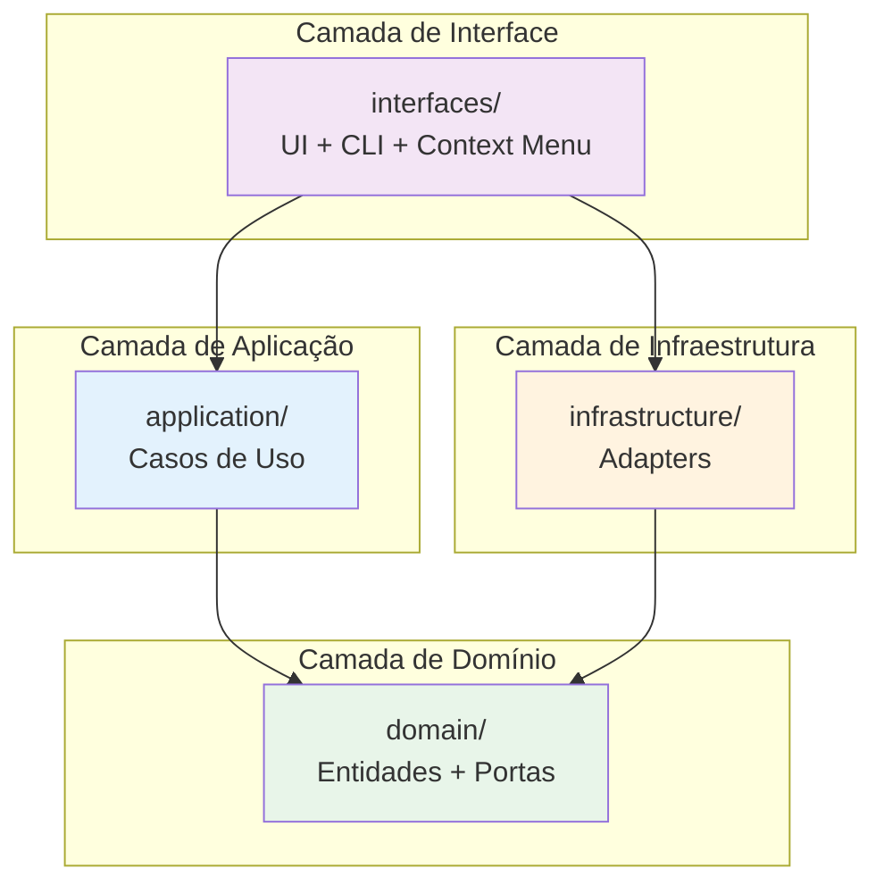
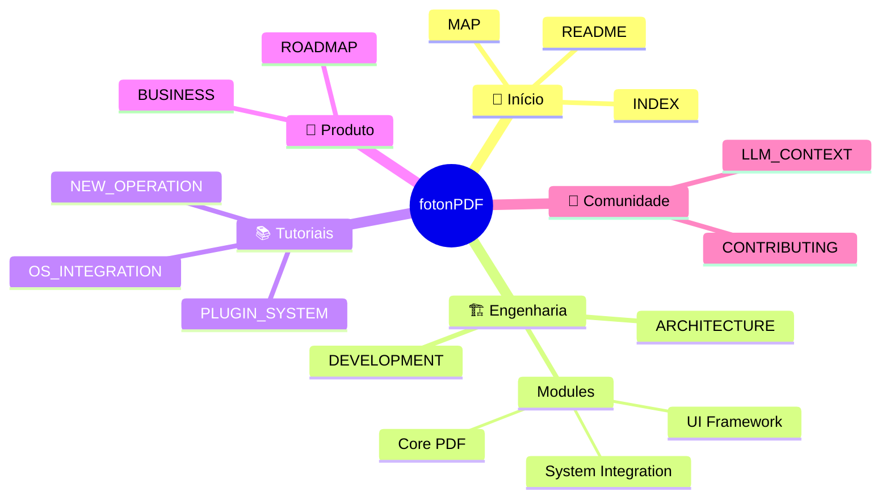

# 🕸️ Grafo de Relacionamentos da Documentação

Este documento usa **Mermaid** para visualizar as conexões entre os documentos do projeto.

## Visão Geral - Hierarquia

## Fluxo de Uso para Diferentes Personas

### 👨‍💻 Desenvolvedor Novo

### 🤖 CodeAssistant (LLM)

### 📊 Product Owner / Stakeholder

## Dependências entre Módulos de Código

## Sistema de Navegação (Obsidian Graph)

## Como Usar Este Grafo

1. **No Obsidian:** Use o plugin "Obsidian Mermaid" para renderizar os diagramas.
2. **No GitHub:** Os diagramas Mermaid renderizam automaticamente.
3. **Localmente:** Use `mermaid-cli` ou ferramentas online.

---

[[MAP|Voltar ao Mapa]] | [[INDEX|Ver Índice Completo]]
